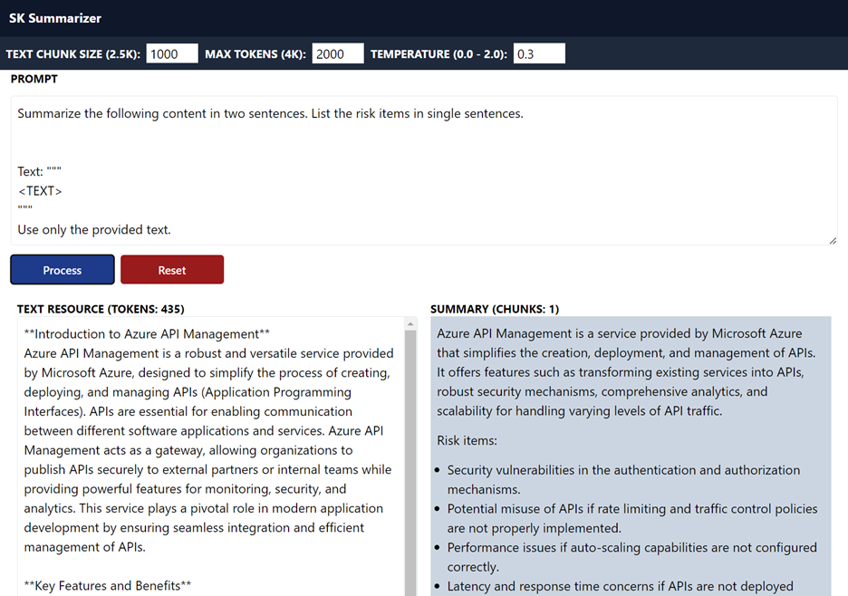
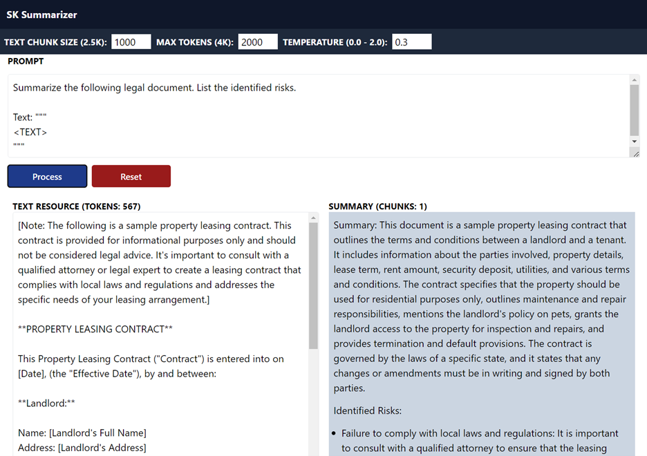

# An Azure OpenAI Summarizer implementation<br/>with Semantic Kernel

Check out my new repo where I have implemented a summarizer (Map Reduce/Refine) implementation using Semantic Kernel and OpenAI GPT. Summarizer may not express well everything this application can do. It really uses the GPT's foundational model abilities to summarize, translate, perform risk analysis, generate content such as code and demand letters, etc.

I implemented this app as a C# Minimal API serving both static files and acting as an API server, but with minor modifications, the same code could power an async job to process a large number of files, for example, in a storage account.

Summarizer is also a powerful playground. You don’t need to give it a large text source. It can reply to a simple prompt. However, if you do give it a large text resource, you can accomplish pretty amazing tasks.

Summarization and RAG pattern can be combined into a powerful solution where based on users' choices the system could answer from multiple sources using the RAG pattern or provide deep answers and insights from specific documents and sources using summarization.

## Frontend

**Note:** I've kept most of the code in the `src/frontend/src/App.tsx`` file for simpler understanding.

- Bun javascript runtime and all-in-one tool
- React
  - Axios
  - React-markdown
- TailwindCSS

## C# Backend

- .NET 7 C# Minimal API
- Semantic Kernel (still in Preview)
- Middleware:
  - Static Files
  - CORS

## Python Semantic Kernel Backend

Requirements: `requirements.txt`

```txt
fastapi
uvicorn[standard]
semantic-kernel
python-dotenv
```

## Python LangChain Backend

Requirements: `requirements.txt`

```txt
fastapi
uvicorn[standard]
langchain
python-dotenv
```

## Required Server environment variables

**Note:** To ge these values, you will need an Azure OpenAI account and deploy a GPT model to a region.

On the `src/backend` and `src/pybackend` folders, you will need to create a `.env` file and set the following values:

```bash
DEPLOYMENT_NAME=<MODEL_NAME>
ENDPOINT=https://<NAME>.openai.azure.com/
API_KEY=<API_KEY>
```

### Running locally

From a Bash/zsh prompt type the following commands:

### CSharp

- Type: `make run`
- Open a browser at: `http://localhost:5084`

#### Python SK

- Type: `make run-py`
- Open a browser at: `http://localhost:8000`

#### Python SK

- Type: `make run-pylang`
- Open a browser at: `http://localhost:8000`

### Run as a container locally using Docker

#### CSharp

- Type: `make docker-run`
- Open a browser at: `http://localhost:8080`

#### Python SK

- Type: `make docker-py-run`
- Open a browser at: `http://localhost:8080`

#### Python LangChain

- Type: `make docker-pylang-run`
- Open a browser at: `http://localhost:8080`

### Building a Docker Container

**Note:** Make sure to provide the required server environment variables if running from somewhere else.

- Type: `make docker`

## Samples use cases

### Process a simple query


### Analyzis and content generation


### Text translation


### Summarization



### Summarization and risk analysis


